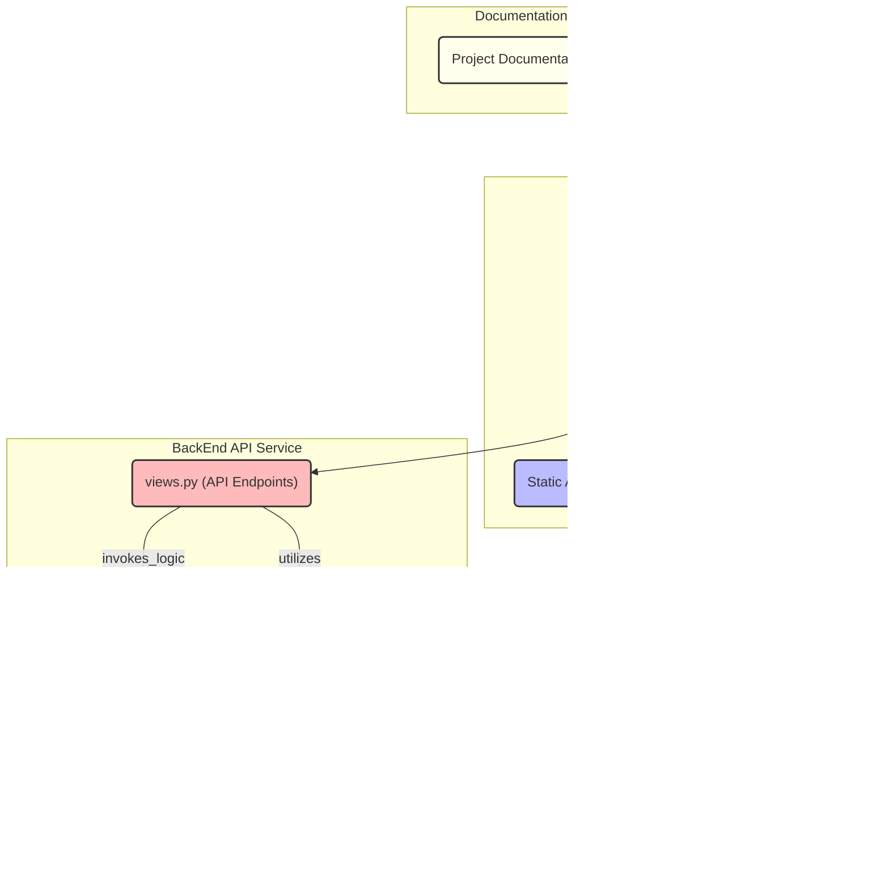

# IPC2_Proyecto3_20210106

http://localhost:5000/api/consultarIngresos?fecha=03/2022
1. Diagrama (generado por gitdiagram):

```mermaid
flowchart TD
    %% User Initiation
    User("User"):::user

    %% FrontEnd Application Subgraph
    subgraph "FrontEnd Application"
        FE_Controller("Django Controller & Settings"):::frontend
        FE_Templates("Templates"):::frontend
        FE_Static("Static Assets"):::frontend
        FE_DB("SQLite DB (Persistence)"):::database
    end

    %% BackEnd API Service Subgraph
    subgraph "BackEnd API Service"
        BE_Run("run.py (Entry Point)"):::backend
        BE_Views("views.py (API Endpoints)"):::backend
        subgraph "Business Logic & Data Handling"
            BE_Storage("data_storage.py"):::backend
            BE_Utils("utils (Folder)"):::backend
        end
        subgraph "Domain Models"
            BE_Models("models (Domain Models)"):::backend
        end
    end

    %% Documentation Subgraph
    subgraph "Documentation"
        Doc("Project Documentation"):::doc
    end

    %% Relationships
    User -->|"accesses"| FE_Templates
    FE_Templates -->|"triggers"| FE_Controller
    FE_Controller -->|"persists_data"| FE_DB
    FE_Controller -->|"calls_API"| BE_Views
    BE_Views -->|"invokes_logic"| BE_Storage
    BE_Views -->|"utilizes"| BE_Utils
    BE_Storage -->|"manages"| BE_Models

    %% Styles
    classDef user fill:#f9d,stroke:#333,stroke-width:2px;
    classDef frontend fill:#bbf,stroke:#333,stroke-width:2px;
    classDef backend fill:#fbb,stroke:#333,stroke-width:2px;
    classDef database fill:#cfc,stroke:#333,stroke-width:2px;
    classDef doc fill:#ffe,stroke:#333,stroke-width:2px;

    %% Click Events
    click BE_Run "https://github.com/sudokentucky/ipc2_proyecto3_20210106/blob/main/BackEnd/run.py"
    click BE_Views "https://github.com/sudokentucky/ipc2_proyecto3_20210106/blob/main/BackEnd/app/views.py"
    click BE_Storage "https://github.com/sudokentucky/ipc2_proyecto3_20210106/blob/main/BackEnd/app/data_storage.py"
    click BE_Utils "https://github.com/sudokentucky/ipc2_proyecto3_20210106/tree/main/BackEnd/app/utils/"
    click BE_Models "https://github.com/sudokentucky/ipc2_proyecto3_20210106/tree/main/BackEnd/models/"
    click FE_Controller "https://github.com/sudokentucky/ipc2_proyecto3_20210106/tree/main/FrontEnd/FrontEnd/"
    click FE_Templates "https://github.com/sudokentucky/ipc2_proyecto3_20210106/tree/main/FrontEnd/FrontEnd/templates/"
    click FE_Static "https://github.com/sudokentucky/ipc2_proyecto3_20210106/tree/main/FrontEnd/FrontEnd/static/"
    click FE_DB "https://github.com/sudokentucky/ipc2_proyecto3_20210106/blob/main/FrontEnd/db.sqlite3"
    click Doc "https://github.com/sudokentucky/ipc2_proyecto3_20210106/tree/main/Documentacion/"
```
